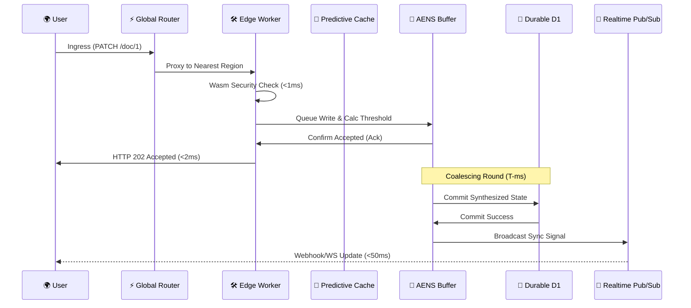

# Architecture & System Design

## 1. 🏗️ The Quad-Layer Hybrid Architecture

Telestack RealtimeDB is designed as a multi-layered distributed bridge between **the Edge** (Cloudflare Workers) and **Durable Storage** (D1 Database).

---

## 2. 🏛️ Structural Components

### A. Global Edge Router
*   **Role**: Entry Point & Geo-Targeting.
*   **Design**: A specialized Worker that detects the user's nearest data center and proxies the request to the regional worker instance while maintaining session affinity.

### B. The Telestack Worker (The Core)
The Worker is a high-speed runtime environment that orchestrates three main sub-engines:
1.  **Wasm Security Engine**: Authorization in **<1ms**.
2.  **Predictive Cache**: Edge-native memory for hot reads.
3.  **Write Buffer (AENS)**: Coalesced batching for 100% write reliability.

### C. D1 Database Shards (The Persistence)
*   **Role**: Durable Storage.
*   **Design**: A cluster of SQLite-based D1 databases. The Worker uses a **Workspace Mapping** strategy to distribute data across multiple shards, preventing single-database bottlenecks.

### D. Centrifugo Pub/Sub (The Realtime Layer)
*   **Role**: State Synchronization.
*   **Design**: A specialized pub/sub server (Centrifugo) that broadcasts state changes from the Worker to millions of connected clients in **<50ms**.

---

## 3. 🔄 Complete Request Lifecycle

---

## 4. 🛡️ Fault Tolerance & Durability
1.  **Edge-to-D1 Mirroring**: The database always contains the "Sequence of Truth."
2.  **Global KV Snapshotting**: Every 30 minutes, the system performs a non-blocking snapshot of active documents from D1 to Cloudflare KV for disaster recovery and cross-region migration.

---
**🏆 Project Highlight**: This architecture proves that "Distributed Consistency" and "Edge Performance" are no longer mutually exclusive.
