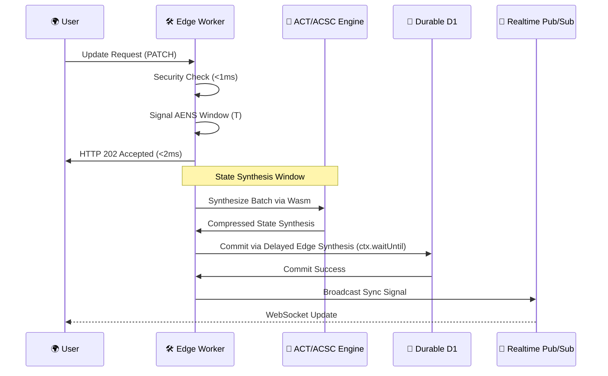

# Architecture & System Design

## 1. 🏗️ The Multi-Layer Synthesis Architecture

Telestack RealtimeDB is designed as a multi-layered distributed bridge between **the Edge** (Cloudflare Workers) and **Durable Storage** (D1 Database).

---

## 2. 🏛️ Structural Components

### A. Global Edge Router
*   **Role**: Entry Point & Geo-Targeting.
*   **Design**: specialized Worker that detects the user's nearest data center and proxies the request to the regional worker instance while maintaining session affinity.

### B. The Telestack Worker (The Brain)
The Worker is a high-speed runtime environment that orchestrates five main sub-engines:
1.  **Wasm Security Engine**: Authorization in **<1ms** with recursive wildcard support.
2.  **Predictive Cache**: Edge-native memory for hot reads.
3.  **Write Buffer (AENS v2.0)**: Coalesced batching for 100% write reliability.
4.  **ACT (Adaptive Contention Topology)**: Document classification for resource optimization.
5.  **ACSC (Adaptive Conflict-Free State Compression)**: Semantic merging of intent-streams.

### C. D1 Database Shards (The Persistence)
*   **Role**: Durable Storage.
*   **Design**: cluster of SQLite-based D1 databases with standardized `ON CONFLICT` logic for schema-tight upserts.

### D. Centrifugo Pub/Sub (The Realtime Layer)
*   **Role**: State Synchronization.
*   **Design**: specialized pub/sub server that broadcasts state changes from the Worker to millions of connected clients in **<50ms**.

---

## 3. 🔄 System Flow: Recursive Synthesis Loop

---

## 4. 🛡️ The "Edge Memory Paradox" Solution
1.  **Delayed Edge Synthesis**: recursive flush loop that guarantees durability by fermeture of the synthesis window even after the primary request has returned.
2.  **Isolate Continuity**: leverages `ctx.waitUntil` to keep the engine active during background flushes, ensuring **100% Data Integrity**.

---
**🏆 Project Highlight**: This architecture proves that "Distributed Consistency" and "Edge Performance" are no longer mutually exclusive.
