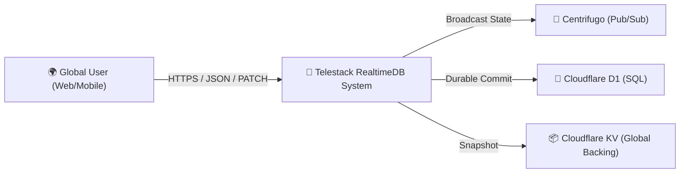
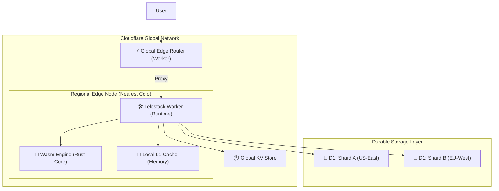
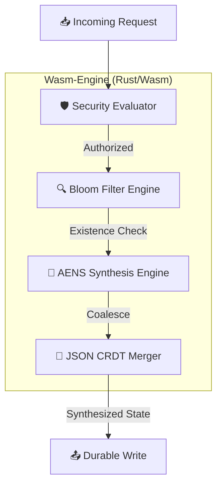
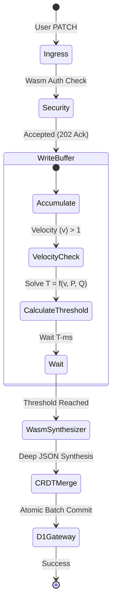
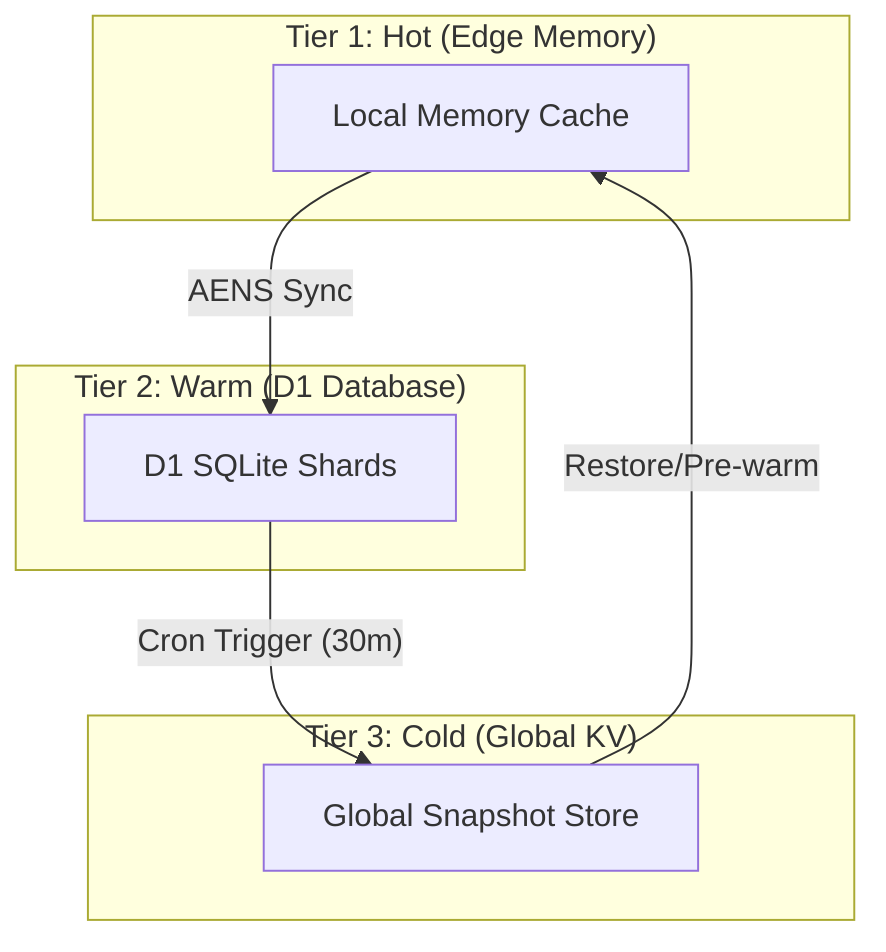

# Visual System Architecture & Design Gallery

This document provides a multi-level visual breakdown of the **Telestack RealtimeDB** architecture, from global ingress down to bit-level Wasm operations.

## 🖼️ High-Fidelity Architectural Overview

---

## 🚀 The AENS Synthesis Engine (Core Invention)

---

## 1. 🌍 System Context (Level 1)
Shows how Telestack interacts with external actors and systems.

---

## 2. 🏗️ Container Diagram (Level 2)
Zooming into the Cloudflare platform ecosystem.

---

## 3. 🧠 Component Diagram: The Wasm Core (Level 3)
Zooming into the "Brain" of the system.

---

## 4. 🔄 Data Flow: The Write-Synthesis Path
Visualizing the AENS v2.0 lifecycle.

---

## 5. 💾 Persistence & Durability Architecture
How the system ensures no data is ever lost.

---
**🏆 Project Highlight**: This visual design eliminates the "Distance Barrier" by ensuring that critical logic (Security & Synthesis) always happens within 1-2ms of the user.
